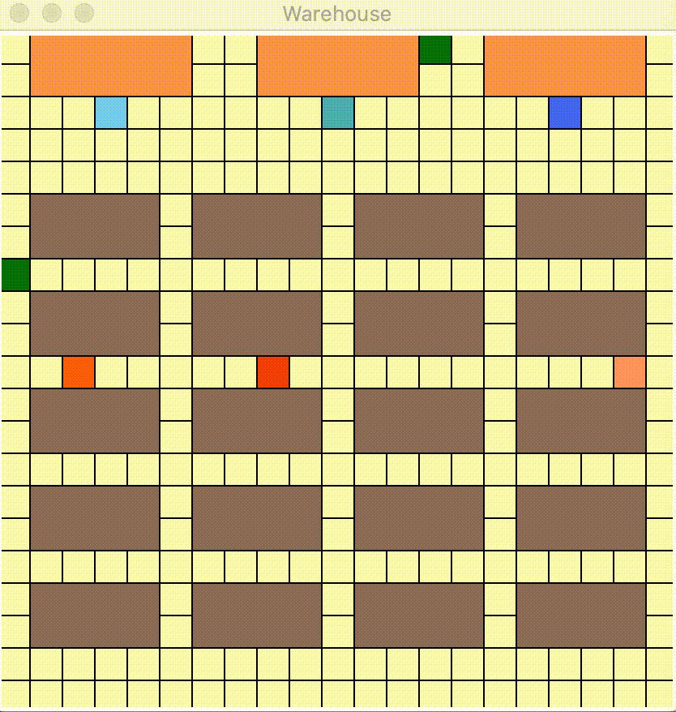

# WarehouseRobotPathPlanning
## Target
The target of this project is to provide a multi-robot path planning solution under a warehouse scenario using q learning. The robots should successfully arrive the storage target without hitting obstacles. Robots would start picking boxes from the operation desks, and after storage, they would return and start a new round of task.

## Approach
Q learning was mainly used for path planning. In order to accelerate the training process, the idea of transfer learning was implied. Basically, the entire path planning task was divided into a hierarchy of  three subtasks. The first step is to train the map. An agent would be trained to get familiar with the warehouse map, and in this step, there would be no target position providing rewards. Only punishment of hitting the shelves and operation desks would be provided. 3000 episodes was performed in this step. The second step is to train the robots to return to the operation desks. Basically, the robots would start at random position in this map, and successfully returning to the operation desk would be rewarded. After these two steps, robots should learn enough knowledge of the surrounding situation, and these prior information would be transferred to all robot agents. In this way, it would tremendously accelerate the training process. One more advantage is that, in the future, if new robot agents will be added into this system, there is no need for them to start training from the sketch, the information from the first two steps would be inherited. In other word, this system is extendable. The process flow chart is shown below.

## Simulation

